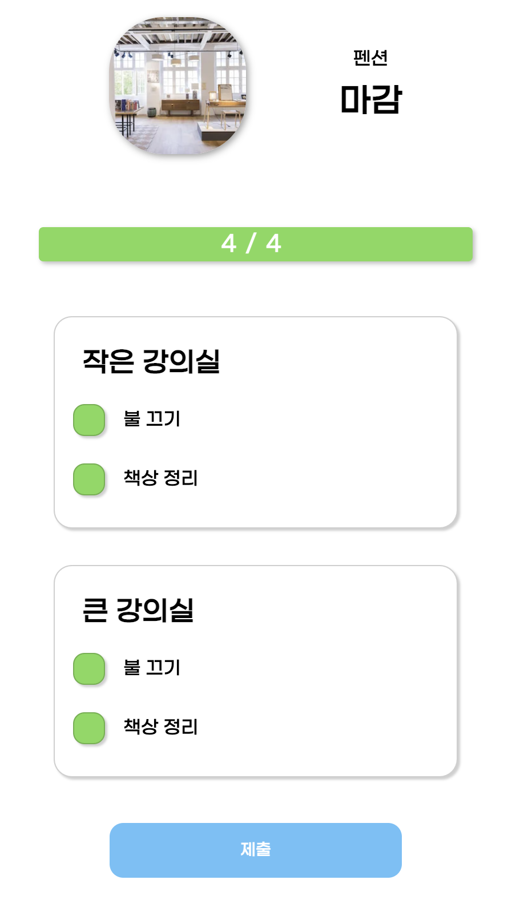

---  
emoji: 📝  
title: '동시성 문제를 해결하기 위한 여러가지 방법'   
date: '2022-11-16 23:00:00'  
author: 어썸오  
tags: concurrency
categories: projects
---  

> 우테코 Lv3에서 진행한 [프로젝트](https://github.com/woowacourse-teams/2022-gong-check) 도중 만났던 동시성 이슈를 해결하기 위해 고민했던 과정을 공유합니다.

제가 진행한 프로젝트에는 하나의 체크리스트 목록에 대한 제출자는 한 명이여야 한다는 요구사항이 있었습니다.



위처럼 모든 작업을 완료하면 제출 버튼을 클릭하여 제출 기록을 생성할 수 있습니다.

하지만 실제로 여러 쓰레드를 만들어 테스트를 진행하면 여러 개의 제출 기록이 남는 문제가 있었습니다. 문제가 발생한 이유는 제출 기록을 생성하기 전에 다른 쓰레드들이 제출을 위한 유효성 검사를
통과해버리기 때문이었습니다. 제출 기록을 생성하기 위한 로직을 단순화하면 아래와 같습니다.

```java

@Transactional
public void createSubmission(Long taskId) {
    if (!checkListRepository.existsByTaskId(taskId) {  // 작업과 연관된 체크리스트가 없으면 예외를 발생시킨다
        throw new IllegalArgumentException();
    }
    submissionRepository.save(new Submission());
    checkListRepository.deleteByTaskId(taskId);
}
```

만약 모든 요청이 순차적으로 처리된다면, 첫 번째 요청에서 제출 기록을 저장하고 체크리스트를 삭제해버리기 때문에 이후의 모든 요청은 검증문을 통과하지 못합니다.
하지만 첫 번째 요청이 체크리스트를 삭제하기 전에 다른 요청들이 1번 검증을 통과해버려 여러 개의 제출 기록이 생성되었습니다.

##  첫 번째 방법. synchronized 키워드

가장 쉬운 접근은 그냥 `synchronized` 키워드를 사용하여 쓰레드를 동기화하는 것입니다. 하지만 이 방식은 두 가지 문제가 있습니다.

첫 번째로, `@Transactional` 애너테이션과 `synchronized` 키워드를 함께 사용하면 **트랜잭션 커밋을 포함한 단위에서의 동시성 제어가 되지 않는다는 것**입니다.

스프링의 선언적 트랜잭션은 프록시 기반으로 동작합니다. 트랜잭션을 열고 닫는 기능은 프록시에서 처리하고 실제 로직 처리를 타겟에게 위임하게 되는데요, 락 자체는 타겟 인스턴스에만
걸리기 때문에 결국 한 쓰레드가 트랜잭션을 커밋하기 전에 다른 쓰레드가 타겟 메서드에 접근할 수 있는 틈이 생깁니다. 이해가 안되시는 분은 [이 글](https://stackoverflow.com/questions/41767860/spring-transactional-with-synchronized-keyword-doesnt-work)을 한번 참고해보세요.

두 번째로 이 방식은 **서버가 여러 대 있는 경우 동시성 제어를 할 수 없습니다**.

* 장점: 간단하고 명확하다.
* 단점: 트랜잭션 전체 단위의 동시성을 보장할 수 없다. 확장성이 떨어진다.

## 두 번째 방법. 네임드 락을 이용한 분산 락

두 번째로 분산 락을 고려했습니다. 해당 로직을 실행하기 전에 락을 얻은 후 모든 로직을 처리하면 락을 반환하는 방식입니다. 분산 락을 구현하는 방법에는 여러가지가 있는데,
저희 팀은 외부 의존성 추가 없이 바로 구현할 수 있는 방법을 사용했습니다. 바로 MySQL의 Named Lock을 활용하는 것입니다.

데코레이터 패턴을 활용하여 타겟 메서드를 호출하기 전에 락을 얻고 타겟 메서드가 종료되면 락을 반납하는 방식으로 구현했습니다.

```java
public class MySQLUserLevelLock implements UserLevelLock {

    private static final String GET_LOCK_QUERY = "select get_lock(?, ?)";
    private static final String RELEASE_LOCK_QUERY = "select release_lock(?)";

    private final JdbcTemplate jdbcTemplate;

    public MySQLUserLevelLock(final DataSource dataSource) {
        this.jdbcTemplate = new JdbcTemplate(dataSource);
    }

    @Override
    @Transactional(transactionManager = "submissionLockTransactionManager")
    public void executeWithLock(final String lockName, final int timeOutSeconds, final Runnable runnable) {
        try {
            getLock(lockName, timeOutSeconds);
            runnable.run();
        } finally {
            releaseLock(lockName);
        }
    }

    private void getLock(final String lockName, final int timeOutSeconds) {
        jdbcTemplate.queryForObject(GET_LOCK_QUERY, Integer.class, lockName, timeOutSeconds);
    }

    private void releaseLock(final String lockName) {
        jdbcTemplate.queryForObject(RELEASE_LOCK_QUERY, Integer.class, lockName);
    }
}

```

> 자세한 코드는 [PR 링크](https://github.com/woowacourse-teams/2022-gong-check/pull/588/files)에서 확인하실 수 있습니다.

비즈니스 로직을 위한 DataSource와 Lock을 위한 DataSource를 따로 나누어 락을 얻기 위해 사용되는 리소스가 애플리케이션에 영향이 가지 않도록하였습니다.

이렇게하면 분산 환경에서도 동시성을 보장할 수 있습니다. 나쁘지 않은 방법이라고 생각합니다. 다만 MySQL의 네임드 락이라는 특정 기술에 종속이 되고 락을 얻고 해제하기 위한
추가적인 코드가 많이 필요하다는 것이 단점이 될 수 있겠습니다. 락을 보관하기 위한 관심사를 DB로부터 완전히 분리하려면 Redis나 ZooKeeper 등을 이용해 분산 락을 구현할 수도 있습니다.

하지만 저희 팀은 조금 더 간단한 방법이 없을까 고민했습니다. 

## 세 번째 방법. 배타 잠금

동시성 문제가 발생하는 이유는 체크리스트를 삭제하기 전에 체크리스트를 읽기 때문입니다.

```

1. 체크리스트가 존재하는지 확인한다.   <-- 여러 쓰레드가 동시에 확인할 수 있는게 문제
2. 체크리스트가 존재하면 제출 기록을 저장한다.
3. 체크리스트를 삭제한다.
```

아얘 1번을 수행할 때 락을 걸어버리면 어떨까요? Spring Data JPA에서는 `@Lock`이라는 애너테이션을 제공합니다. `LockModeType` 속성을 통해 여러 레벨의 락을 사용할 수 있습니다.

체크리스트가 존재하는지 확인할 때 비관적 배타 잠금을 걸어서 선행 트랜잭션이 커밋되기 전까지는 체크리스트의 존재 여부를 확인할 수 없도록하면 동시성을 제어할 수 있습니다.

```java

public interface CheckListRepository extends JpaRepository<CheckList, Long> {

    @Lock(value = LockModeType.PESSIMISTIC_WRITE)
    boolean existsByTaskId(Long taskId);
}

```

주의할 점으로는 생긴 것은 조회 메서드이지만 배타 락을 걸기 때문에 `read-only` 트랜잭션에서 이 메서드를 사용하면 예외가 발생합니다. 실제 쿼리가 MySQL의 경우 
`SELECT ... FOR UPDATE` 형태로 나가기 때문입니다. 따라서 실수로 다른 조회용 로직에서 사용하지 않게 메서드 이름에 표현을 해주거나 문서화를 해줄 필요가 있습니다.

```java

public interface CheckListRepository extends JpaRepository<CheckList, Long> {

    @Lock(value = LockModeType.PESSIMISTIC_WRITE)
    boolean existsByTaskIdWithXLock(Long taskId);
    
    boolean existsByTaskId(Long taskId);
}

```

애너테이션 하나로 동시성 제어가 가능하고 스케일 아웃을 하더라도 문제가 없다는 장점이 있습니다. 다만 위에서 언급했듯 개발자가 실수로 `read-only` 트랜잭션에서 해당 메서드를 사용하지 
않도록 주의해야한다는 단점이 있습니다.

## 네 번째 방법. 유니크 제약 조건

이건 문제를 해결할 당시에는 고려를 못했고, 후에 프로젝트 최종 데모데이를 할 때 제이슨 코치님이 질문을 해주셔서 알게된 방법입니다. '제출' 테이블에 유니크 제약 조건을 적용해서 락을 걸지 않고도 두 개 이상의 제출 기록이 생성되지 못하도록 막는 방법입니다. 
"하나의 체크리스트 목록에 대한 제출 기록은 하나여야한다." 라는 비즈니스 요구사항을 테이블에도 반영하는 것이죠. 테이블 스키마를 바꿔야한다는 전제 조건이 있지만 락을 걸지 않고도 해결할 수 있다는 점에서 큰 장점이 있는 것 같습니다. 

제이슨 코치가 '왜 꼭 락을 걸어야할까요? 유니크 제약을 활용하는 방법도 있을텐데요'라고 말씀을 하셨을 때, 머리를 한 대 얻어맞은 기분이었습니다. 
문제 정의 자체를 '트랜잭션을 순차적으로 실행해야한다'로 시작했기 때문에 락을 건다는 전제 조건에서 벗어나지 못한 채 좁은 시야로 문제를 해결하려고 했던 것 같습니다.

"하나의 체크리스트 목록에 대한 제출 기록은 하나여야한다"라고 하는 비즈니스 요구사항에 집중하여 방법을 고민했더라면 그리 어렵지 않게 떠올릴 수 있었을지도 모릅니다.


```toc
```

