---  
emoji: 📝  
title: '[Java Study 1주차] JVM은 무엇이고 자바 코드는 어떻게 실행하는 것인가'   
date: '2020-12-28 23:00:00'  
author: 어썸오  
tags: java
categories: Java-Basic
---  

> 본 포스팅은 백기선님이 진행하시는 [자바 스터디](https://github.com/whiteship/live-study)를 진행하며 혼자 공부하고 이해한 내용을 바탕으로 정리한 글입니다. 오류나 지적 사항이 있다면 댓글로 알려주시면 감사하겠습니다.


-   목표: 자바 소스 파일(\*.java)을 JVM으로 실행하는 과정 이해하기


<br>

## 자바 프로그램은 어떤 과정을 거쳐서 실행될까?

자신이 사용하는 언어로 작성된 프로그램이 어떤 방식으로 동작하는지 아는 것은 매우 중요합니다. 그래야 문제가 발생하더라도 어떤 과정에 어떤 부분에서 문제가 생겼는지, 
왜 이런 문제가 발생했는지 등을 이해할 수 있습니다.

이 글에서는 자바 프로그램이 어떻게 동작하는지 대략적으로 알아보도록 하겠습니다.

컴퓨터 프로그램은 먼저 사람이 읽을 수 있는 프로그래밍 언어로 작성된 후 이를 컴퓨터가 알아들을 수 있는 기계어로 번역되어 컴퓨터가 이를 수행합니다. 
여기서 프로그래밍 언어로 작성된 **소스코드(source code)를 기계어(machine code)로 번역하는 과정**을 **컴파일(compile)** 이라고 합니다.

기계어는 운영체제마다 그 형태가 다릅니다. 예를 들어 윈도우에서 실행되는 기계어는 맥이나 리눅스에서는 실행되지 못합니다. 이를 "운영체제에 종속적이다"라고 표현합니다.

C와 C++같은 컴파일 언어는 소스코드를 컴파일 과정에서 기계어로 번역하기 때문에 운영체제에 종속적입니다. 즉 윈도우에서 작성하고 컴파일한 C 프로그램은 맥이나 리눅스에서 실행될 수 없습니다. 
이렇게 되면 프로그래머는 같은 프로그램이라도 윈도우용, 맥용, 리눅스용 프로그램을 따로 작성해야 하는 문제가 발생합니다.

자바는 이렇게 프로그램이 운영체제에 종속되는 문제점을 해결하고자 **바이트코드**라는 중간 단계를 두고, 
JVM(Java Virtual Machine)에서 바이트코드를 기계어로 번역하는 과정을 거칩니다. 그렇기 때문에 바이트코드로 한 번만 컴파일하면, 해당 운영체제에 맞는 JVM만 구비되어 있다면 재컴파일할 필요 없이 프로그램을 실행할 수 있습니다.

### JVM(Java Virtual Machine)이란?

`JVM`은 쉽게 말하면 **자바 프로그램을 실행하는 가상 기계** 입니다. 위에서 언급했듯 C나 C++로 작성된 프로그램은 운영체제에 종속적인데, 자바는 운영체제 위에 자바를 실행하는 기계를 하나 더 얹어서 종속성을 해소합니다.

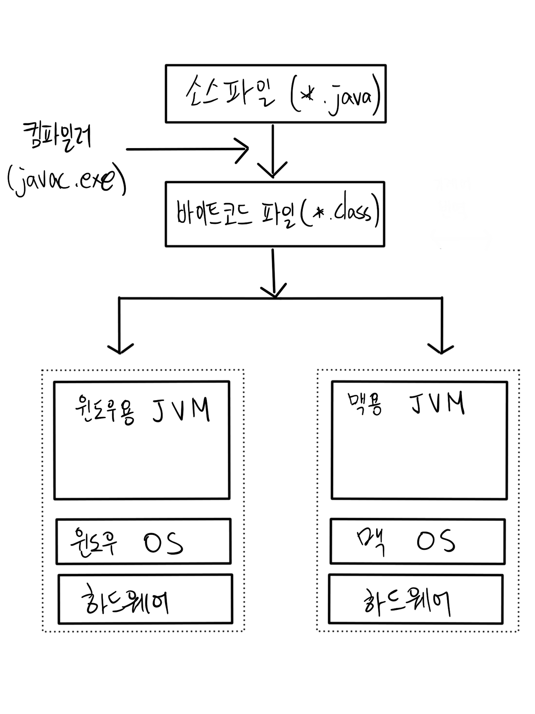

먼저 프로그래머는 프로그래밍 언어(이 경우엔 Java)로 소스코드 파일(\*.java) 작성합니다.

작성된 소스코드는 **자바 컴파일러(javac.exe)에 의해 바이트코드 파일(\*.class)로 변환**됩니다(바이트코드가 뭔지는 밑에서 설명하겠습니다).

바이트코드 파일은 **자바 인터프리터(java.exe)에 의해 JVM에서 해당 운영 체제에 맞게 기계어로 번역**됩니다.

따라서 프로그래머가 자바 프로그램을 한번 작성하면, 사용자는 각 운영체제에 맞는 JVM 위에서(JVM은 운영 체제에 종속적) 프로그램을 구동함으로써 서로 다른 운영체제에서 프로그램을 실행할 수 있죠.

기존에 운영 체제에 프로그램 언어 자체가 종속되던 컴파일 방식의 문제점을 Java는 서로 다른 운영체제에서 구동되는 JVM을 미리 만들어 놓음으로써 언어 자체는 운영체제와 독립적으로 사용될 수 있도록 한 것 입니다.

소스파일(_.java) -> 바이트코드(_.class) 변환은 컴파일 시점에서 자바 컴파일러(javac.exe)가 수행하고, 바이트코드 -> 기계어 변환은 런타임 환경, 즉 실행 과정에서 자바 인터프리터와 JIT 컴파일러가 수행합니다.아래의 그림을 참고해주세요.

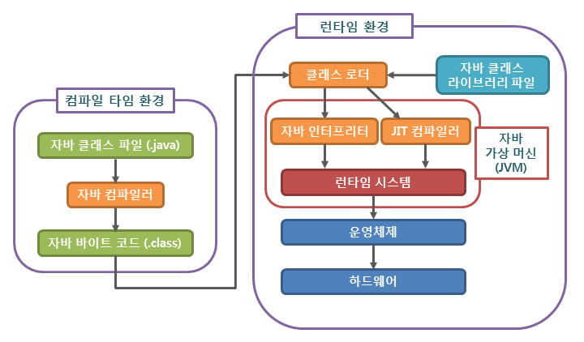

출처: [http://www.tcpschool.com/java/java\_intro\_programming](http://www.tcpschool.com/java/java_intro_programming)

### JIT(Just-In-Time) 컴파일러란?

위 그림을 보면 자바 인터프리터와 JIT 컴파일러가 나란히 동작하는 것을 알 수 있습니다. 둘 다 바이트코드를 기계어로 번역하는 기능을 합니다. 그럼 왜 두 가지로 나뉘어져 있을까요?

전통적으로 프로그램이 구동하는 방식은 두 가지가 있습니다.

1.  인터프리트 방식
2.  정적 컴파일 방식

인터프리트 방식은 런타임에 코드를 한줄 한줄 읽으면서 기계어로 번역하는 방식이고, 컴파일 방식은 실행 전에 미리 기계어 번역을 해두고 이를 런타임에 실행시키는 방식입니다. 
인터프리트 방식은 빌드 타임이 적은 반면 런타임에 번역을 하기 때문에 실행 속도가 느리고, 컴파일 방식은 실행 속도는 빠르지만 그 전에 미리 번역을 해둬야하기 때문에 빌드 타임이 오래 걸립니다.

인터프리트 방식이 속도가 느린 또다른 이유 중 하나는 중복된 코드를 매번 새로 번역하기 때문인데, JIT 컴파일러는 이런 인터프리트 방식의 단점을 보안하기 위해 만들어졌습니다.

런타임에 자바 인터프리터가 바이트코드를 번역하면 JIT 컴파일러도 동시에 돌아가면서 **중복되는 코드를 미리 기계어로 캐싱** 해놓습니다. 
그러다가 인터프리터가 중복된 코드를 만나면 미리 캐싱해둔 기계어를 이용합니다. 이 때문에 실행 속도가 더욱 빨라질 수 있는 것입니다. 
이런 작업은 JVM이 알아서 해주기 때문에 개발자가 동작 과정을 자세히 알 필요는 없지만, 최소한 JIT 컴파일러가 어떤 역할을 하는지는 알아두는 것이 좋습니다.

좀 더 상세한 내용을 알고 싶으시면 [이 글](https://www.quora.com/If-a-JIT-compiler-compiles-the-bytecode-into-machine-code-what-is-the-interpreter-doing-Does-it-simply-run-the-machine-code-Do-JIT-and-the-interpreter-work-in-parallel)을 읽어 보시기 바랍니다.

### JRE & JDK

위에서 런타임 환경이라는 말이 계속 등장했는데요. 런타임 환경은 다른 소프트웨어를 실행하기 위해 고안된 소프트웨어입니다. 
프로그램을 실행하려면 클래스 파일들을 로드하고, 메모리와 각종 시스템 자원에 접근하는 등 여러 작업을 수행해야 하는데 그런 역할을 하는 소프트웨어라고 보면 됩니다.

자바용 런타임 실행 환경인 **JRE(Java Runtime Environment)** 에는 자바 클래스 라이브러리(Java class Library), 자바 클래스 로더(Java class Loader), JVM 등이 포함됩니다. 
자바 프로그램을 실행하고 싶다면 JRE를 설치해야 합니다.

반면 자바 프로그램을 개발하고 싶다면 JDK(Java Development Kit)를 설치해야 합니다. JDK는 자바 개발을 위해 필요한 툴을 모아 놓은 소프트웨어 패키지입니다. 
JDK에는 JRE가 포함되어 있으므로 JDK를 설치했다면 JRE를 따로 설치할 필요는 없습니다(오라클의 경우 자바 11부터는 JDK만 제공하고 JRE는 따로 제공하지 않습니다).

JDK에는 자바 컴파일러(javac.exe), 자바 인터프리터(java.exe), 자바 역어셈블러(javap.exe) 등 자바 개발을 위해 필요한 여러 프로그램들이 들어있습니다.

## 컴파일과 실행

이제 실제로 자바 파일을 작성하고 컴파일한 뒤 실행해봅시다. 자바를 설치하고 환경변수를 설정하는 방법은 다른 글을 참조해주세요.

우선 터미널을 띄우고 파일 하나를 작성해봅시다. 사용하는 편집기, 혹은 메모장으로 Hello.java 파일을 만들고 코드를 작성해봅시다.

"Hello Java"라는 문자열을 출력하는 간단한 프로그램 하나를 작성해보도록 하죠.

> $ vi Hello.java

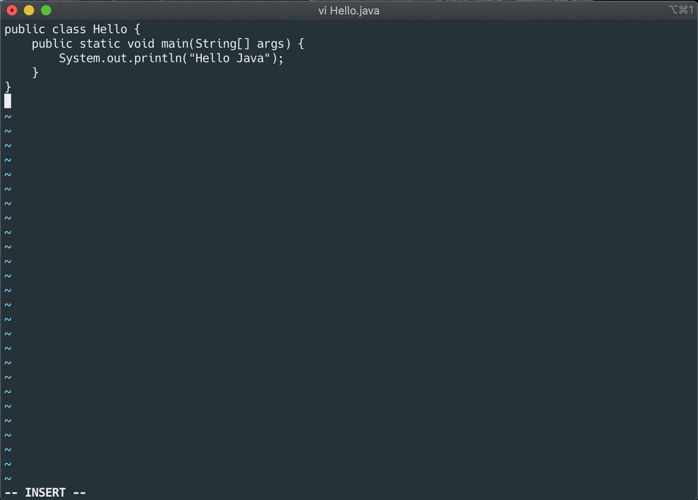

class 이름은 파일 명과 일치해야 합니다 (이 경우에는 Hello)

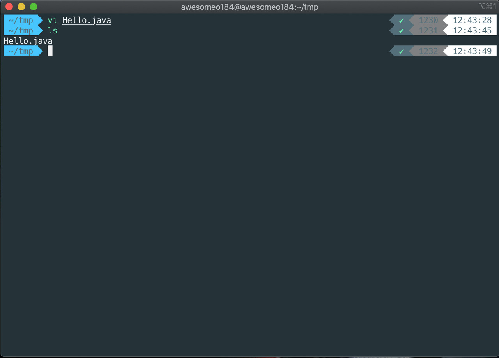

이제 JVM이 우리가 작성한 코드를 돌릴 수 있도록 바이트코드로 변환해줍니다. 소스코드(_.java) 파일을 바이트코드(_.class) 파일로 변환하려면 자바 컴파일러(javac.exe)를 사용하면 됩니다. 자바 컴파일러를 실행하는 명령은 `javac`입니다.

> $ javac Hello.java

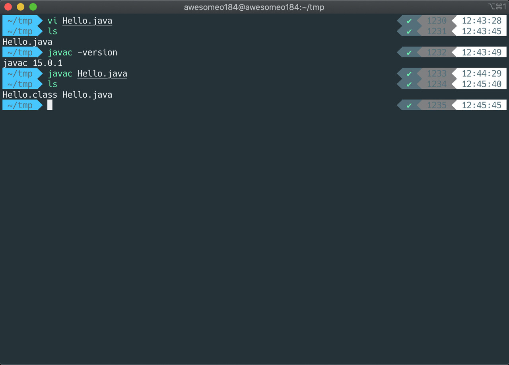

해당 명령어를 실행하면 `Hello.class`라는 파일이 새로 생성된 것을 확인할 수 있습니다.

이제 이 클래스파일을 JVM에서 실행해봅시다. 자바 어플리케이션을 구동하는 명령어는 `java`입니다.

> $ java Hello

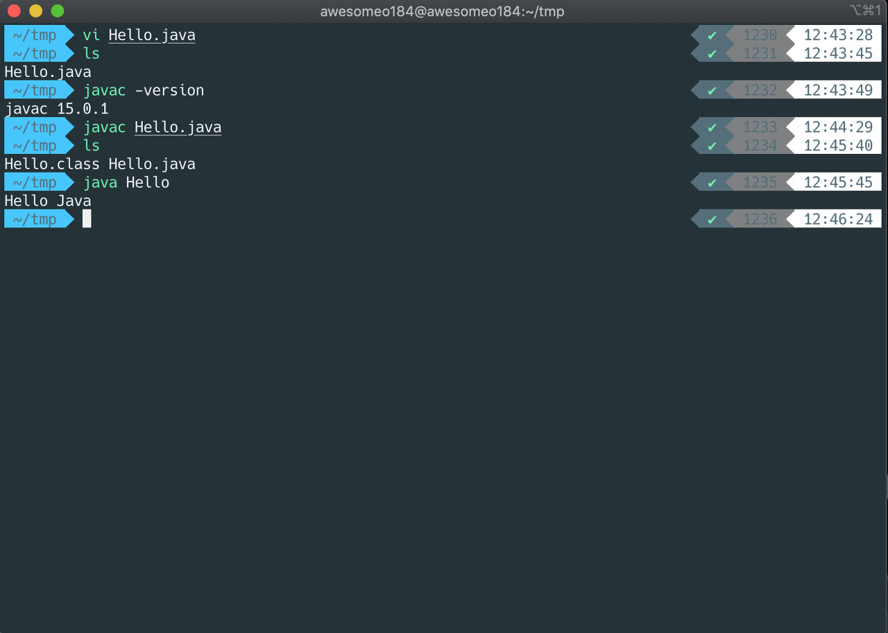

"Hello Java"라는 문자열이 잘 출력되는 것을 확인할 수 있습니다.

### 명령어 옵션

`javac`, `java` 같은 명령어는 여러 옵션을 추가하여 사용할 수 있습니다.

한 가지 예를 들어보죠. 만약 **상위 버전의 JDK에서 컴파일된 바이트코드 파일을 하위 버전의 자바 환경에서 실행하면** 어떻게 될까요?

위에서 실행한 `Hello.class` 파일은 OpenJDK 15.0.1에서 컴파일한 것입니다. OpenJDK 1.8로 방금 컴파일한 파일을 실행해보도록 하겠습니다.

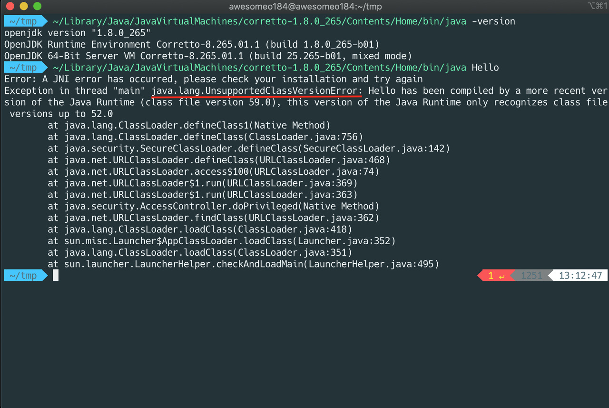

이렇게 상위 버전에서 컴파일된 파일을 하위 버전에서 실행하려고 하면 `UnsupportedClassVersionError`가 발생합니다( but, 하위 버전에서 컴파일된 파일은 상위 버전에서 실행해도 에러가 발생하지 않습니다).

이러한 에러가 나지 않도록 하고 싶으면, `javac` 명령어로 컴파일을 할 때, source option과 target option을 주고 컴파일을 하면 됩니다.

> $ javac -source 1.8 Hello.java    
> or    
> $ javac -source 1.8 -target 1.8 Hello.java

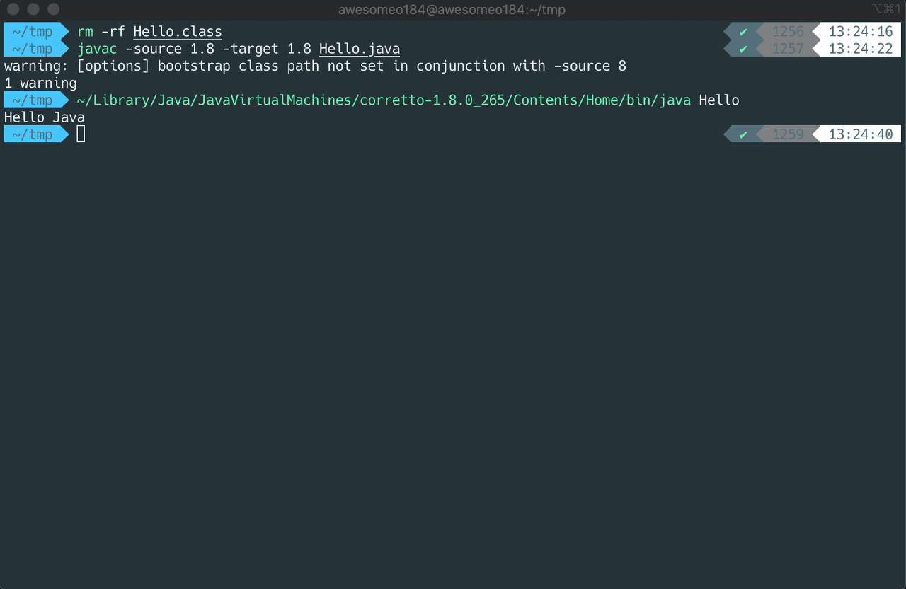

\-source opiton과 -target option에 대한 정보는 [링크](https://stackoverflow.com/questions/15492948/javac-source-and-target-options) 참조

이렇게 하면 하위 버전에서도 문제없이 실행할 수 있습니다. 다만 컴파일러도 지속적으로 업데이트를 거치면서 더욱 효율적인 방법으로 컴파일을 하기 때문에 이렇게 하위 버전으로 컴파일하게 되면 당연히 업데이트의 이점을 누릴 수 없습니다.

### 바이트코드(Bytecode)란?

아까부터 바이트코드라는 말을 계속 사용했는데요. 바이트코드가 뭘까요? 바이트코드란 하드웨어가 아닌 가상 기계에서 돌아가는 이진 코드입니다. 
바이트코드는 사람이 읽을 수 있는 소스코드보다는 추상화 수준이 낮고, 컴퓨터가 읽을 수 있는 기계어보다는 추상화 수준이 높습니다. 
역사적으로 바이트코드는 명령 코드(opcode)가 1바이트 크기였기 때문에 바이트코드라고 불린다고 합니다.

바이트코드를 직접 확인하려면 자바 역어셈블러 `javap.exe`를 사용하면 됩니다. -c 옵션을 사용하면 역 어셈블된 코드를 볼 수 있습니다.

> $ javap -c Hello

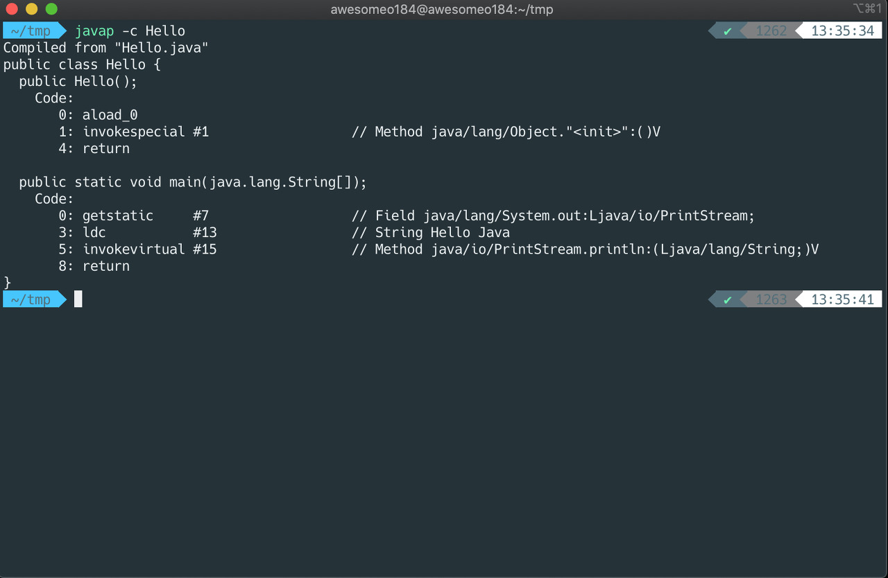

## JVM의 구성

끝으로 JVM의 구성을 살펴보면서 자바 프로그램이 동작하는 과정을 좀더 세세히 살펴보도록 하겠습니다.

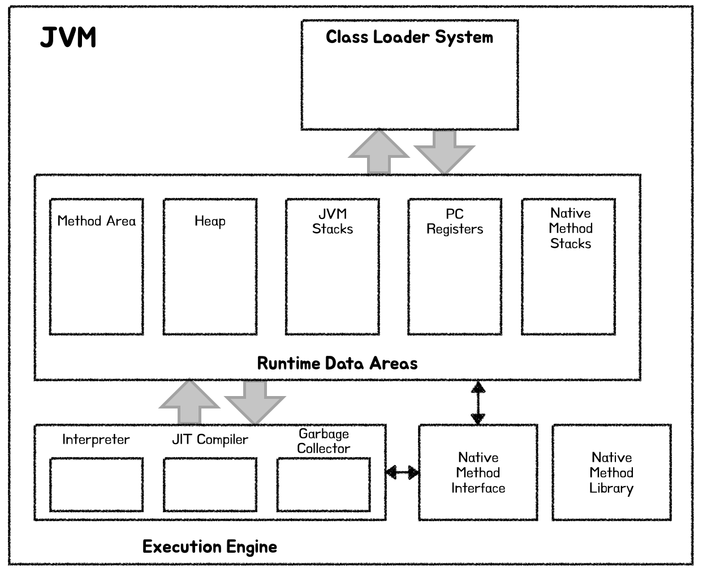

JVM은 네 가지로 구성되어 있습니다.

### 클래스 로더(Class Loader)

클래스 로더는 클래스를 메모리에 적재(load)하는 역할을 합니다. 중요한 것은 클래스는 컴파일 시점이 아닌 런타임 시점에서 동적으로 로드됩니다. 즉 main() 메서드를 시작으로 프로그램이 실행되다가 처음 클래스를 만날 때 로드합니다.

이 또한 C와 C++와 다른 점 중 하나인데요, C/C++는 링크 과정을 통해 실행에 필요한 모든 코드를 하나의 실행 파일(.exe)로 저장하는 반면 자바는 이런 링크 과정을 거치지 않고
필요할 때마다 클래스를 동적으로 로드합니다.

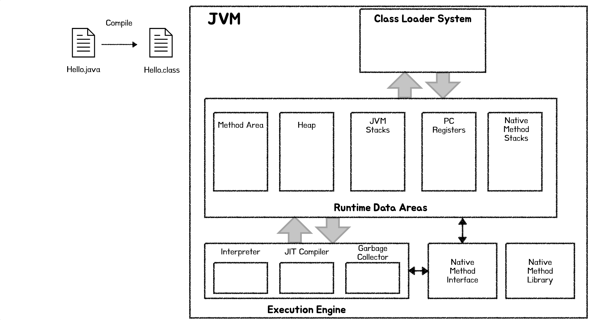

### 실행 엔진(Execution Engine)

클래스 로더가 클래스를 로딩하는 작업을 마치면, JVM은 각 클래스에 있는 코드를 실행하기 시작합니다. 이 기능을 처리하는 것이 실행 엔진입니다. 앞서 살펴본 바이트코드를 기계어로 해석하고 실행하는 부분이 여기 해당됩니다.

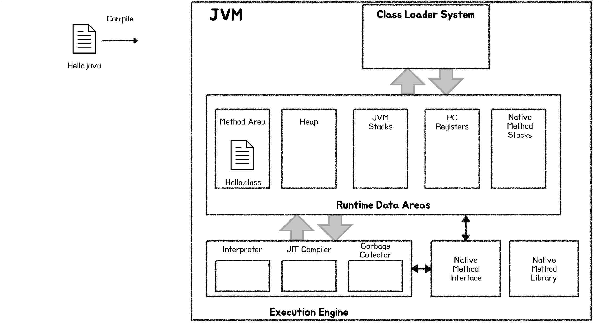

### Garbage Collector

더이상 참조되지 않는 객체 등을 메모리에서 제거해주는 역할을 합니다. Java 이전에는 프로그래머들이 직접 메모리를 관리해야 했지만, Java에서는 Garbage Collector가 메모리를 자동으로 관리해줍니다.

### Runtime Data Area

JVM의 메모리 영역입니다. 구조는 다음과 같습니다.

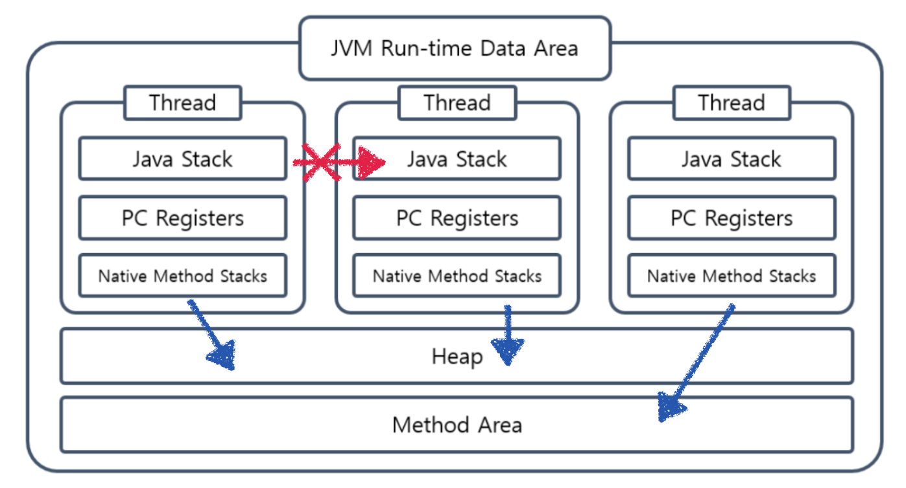

Stack, PC Register, Native Method Stack은 Thread마다 각자 가지고 있으며, Heap, Method Area는 모든 쓰레드가 공유합니다.

- Method Area (메소드 영역) : 클래스 로더가 적재한 모든 클래스에 대한 정보들(클래스 변수 및 각종 메타 데이타)을 저장합니다.
- Heap (힙): 프로그램이 실행되는동안 생성되는 모든 인스턴스 정보가 여기에 동적으로 생성됩니다.
- JVM Stacks: (or Call Stack): 메소드 작업에 필요한 메모리 공간을 제공합니다. 메소드가 호출되면 여기에 매개변수, 지역변수, 메서드 호출 주소 등이 저장됩니다. 메소드가 작업을 마치면 비워집니다.
- PC Registers: 현재 실행되고 있는 명령어의 주소를 저장하고 있습니다. 멀티쓰레드 프로그래밍 환경에서 한 쓰레드가 작업을 하다가 다른 쓰레드로 잠시 CPU 점유를 넘겨주고 다시 돌아왔을 때, 이전에 어떤 명령을 수행하고 있었는지 기억하고 있어야 이전 작업을 다시 이어서 수행할 수 있겠죠. 이를 위해 존재하는 영역입니다.
- Native Method Stacks: C나 C++로 작성된 메서드를 실행할때 사용되는 스택입니다.


```toc
```