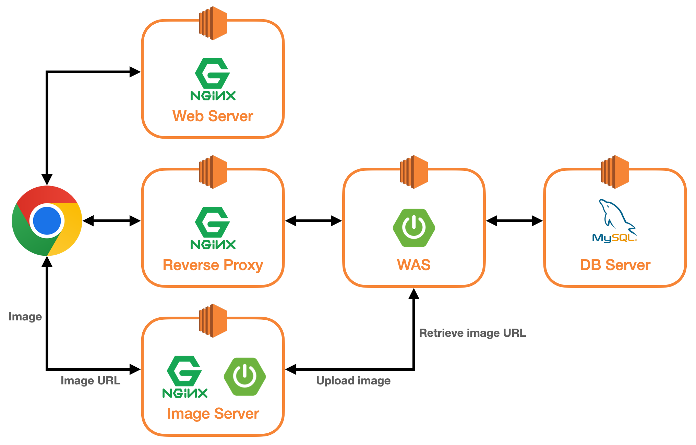
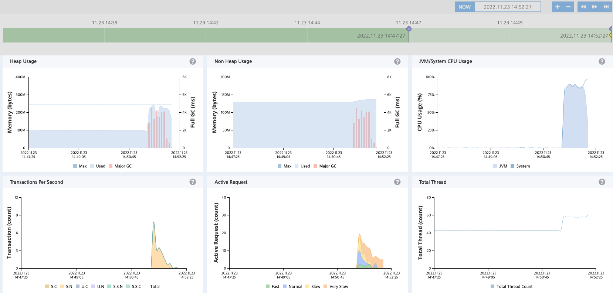
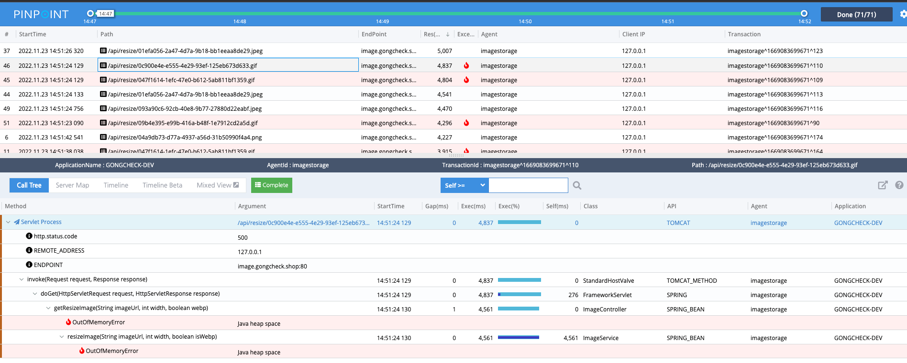
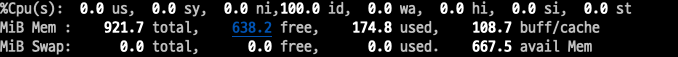

---  
emoji: 📝  
title: '서버 메모리 부족 문제 해결기'   
date: '2022-11-20 23:00:00'  
author: 어썸오  
tags: JVM OOME
categories: projects
--- 

draft

> 부족한 서버 스펙으로 어떻게든 에러를 막아보고자 고군분투했던 이야기를 정리해보았습니다...

우테코 프로젝트 제약상 S3같은 스토리지 서비스를 사용할 수 없어 직접 EC2에 이미지 스토리지 서버를 구축해 서비스를 운영하고 있었습니다.

아래 인프라 구조에서 볼 수 있듯이 클라이언트에서 이미지 서버로 이미지 조회를 요청하도록 설계하였습니다.



<br>

그런데 이미지 조회에 대한 부하테스트 중, 테스트를 시작하자마자 엄청난 에러가 쏟아지는 것을 확인했습니다. 사용자가 적다보니 운영에서는 미처 발견하지 못한 문제였습니다.





위 사진에서 확인할 수 있듯이 테스트가 시작되자마자 Full GC가 비정상적으로 발생하고, 힙 공간 부족으로 인한 OutOfMemoryError가 발생하고 있었습니다.

이미지 서버는 t4.micro를 사용하고 있었고 메모리 크기는 1GB 였습니다. 최대 힙 크기 설정을 따로 해주지 않았기 때문에 기본 값을 사용하고 있었는데 확인해보니 64MB였습니다(위 이미지는 128MB로 바꾸고 난 뒤 같은 상황을 재현한 것입니다).

최대 힙 크기의 기본 값은 시스템의 램 크기의 1/4을 사용하도록 설정한다고 합니다. 단 서버의 메모리가 1GB 이하일 때는 기본적으로 64MB를 사용한다고 하네요.

단순히 최대 힙 크기를 늘리면 해결되겠지 생각하고 최대 힙 크기를 256MB로 올렸습니다. '적절한 최대 힙 크기를 어떻게 결정할 것인가'는 참 고민이 되는 문제였는데요,
아직 제 나름의 답을 찾지는 못했습니다. 지속적으로 시스템을 모니터링하면서 적절한 값을 찾아나가는 수밖에 없을 것 같습니다.

우선은 우아한테크코스 내에서만 사용한다고 가정했을 때는 한번에 20개의 이미지 동시 요청만 버틸 수 있으면 크게 문제될 일은 없습니다. 하지만 범용적으로 사용된다고 가정했을 때는 
과연 어느정도까지 버틸 수 있어야하는가를 설정하기가 쉽지 않았습니다. 그래서 우선은 JMeter를 사용해 20개의 스레드가 한 번에 이미지 조회 요청을 보내도록 설정해놓고 
OOME가 발생하지 않도록 튜닝해보자고 결정했습니다.

애플리케이션을 띄우고 `top`으로 현재 메모리 상태를 살펴보니 600MB 정도 남아있는 것을 확인했습니다. 절반 정도 할당하면 적당하지 않을까 생각하고 256MB를 할당했습니다.



그런데 힙 최대 크기를 올리고 테스트를 진행하자 이번엔 아얘 **JVM 프로세스가 죽어버리는 현상**이 일어났습니다.

시스템 로그를 보니 OOM Killer가 자바 프로세스를 죽인 것을 확인할 수 있었습니다.

```
$ journalctl --list-boots | \
    awk '{ print $1 }' | \
    xargs -I{} journalctl --utc --no-pager -b {} -kqg 'killed process' -o verbose --output-fields=MESSAGE
```

```
Wed 2022-11-23 07:35:42.203997 UTC [s=4b7faf640c5545fdbf02b34ed08b086a;i=6ed5;b=e10d3cde6eef49429f7b5434b5b5898c;m=680b78ad03;t=5ee1e55f68c5d;x=66d2140e7d530357]
MESSAGE=Out of memory: Killed process 16021 (java) total-vm:3328880kB, anon-rss:699868kB, file-rss:0kB, shmem-rss:0kB, UID:0 pgtables:2004kB oom_score_adj:0
```

우선 사용 가능한 메모리 공간을 늘리고자 스왑 공간을 2GB 더 할당하였습니다. 이렇게하면 당장 필요하지 않은 프로세스를 스왑 아웃함으로써 메모리 공간을 확보할 수 있습니다.
이렇게하니 OOM Killer에 의해 프로세스가 죽는 일은 발생하지 않았습니다. 하지만 20개의 이미지가 동시에 요청이 왔을 때는 여전히 힙 공간 부족으로 인한 OOME가 발생했습니다.

이미지라는 자원은 변경이 거의 일어나지 않고 조회가 대부분인 특징이 있습니다. 캐시를 적극적으로 활용할 수 있는 자원입니다. 실제로 Nginx를 통해 동일한 이미지 요청에
대해서는 캐시 처리를 하고 있기 때문에 실제로 WAS에 이미지 조회 요청이 몰리는 경우는 잘 발생하지 않을 것이라고 예상했습니다.
그래서 '예외적인 상황을 대비하여 응답 속도는 조금 느리더라도 서버가 죽는 것은 막는다'는 것을 목표로 개선을 진행하였습니다.


[메모리 분석하는법]

-XX:NativeMemoryTracking=summary

```

Native Memory Tracking:

Total: reserved=2082907KB +15KB, committed=448079KB +79KB

-                 Java Heap (reserved=524288KB, committed=262144KB)
                            (mmap: reserved=524288KB, committed=262144KB)

-                     Class (reserved=1118043KB, committed=77903KB)
                            (classes #14122)
                            (  instance classes #13293, array classes #829)
                            (malloc=1883KB #32845 +19)
                            (mmap: reserved=1116160KB, committed=76020KB)
                            (  Metadata:   )
                            (    reserved=67584KB, committed=66420KB)
                            (    used=65294KB +23KB)
                            (    free=1126KB -23KB)
                            (    waste=0KB =0.00%)
                            (  Class space:)
                            (    reserved=1048576KB, committed=9600KB)
                            (    used=8935KB)
                            (    free=665KB)
                            (    waste=0KB =0.00%)

-                    Thread (reserved=102637KB, committed=5125KB)
                            (thread #50)
                            (stack: reserved=102400KB, committed=4888KB)
                            (malloc=180KB #302)
                            (arena=58KB #99)

-                      Code (reserved=249109KB +9KB, committed=23805KB +73KB)
                            (malloc=1421KB +9KB #7255 +31)
                            (mmap: reserved=247688KB, committed=22384KB +64KB)

-                        GC (reserved=57974KB +1KB, committed=48246KB +1KB)
                            (malloc=5710KB +1KB #8969 +26)
                            (mmap: reserved=52264KB, committed=42536KB)

-                  Compiler (reserved=178KB, committed=178KB)
                            (malloc=45KB #517)
                            (arena=133KB #5)

-                  Internal (reserved=1039KB, committed=1039KB)
                            (malloc=1007KB #1909)
                            (mmap: reserved=32KB, committed=32KB)

-                     Other (reserved=8275KB, committed=8275KB)
                            (malloc=8275KB #17)

-                    Symbol (reserved=17138KB, committed=17138KB)
                            (malloc=14700KB #176682 +3)
                            (arena=2437KB #1)

-    Native Memory Tracking (reserved=3663KB +5KB, committed=3663KB +5KB)
                            (malloc=18KB +3KB #235 +50)
                            (tracking overhead=3645KB +2KB)

-               Arena Chunk (reserved=178KB, committed=178KB)
                            (malloc=178KB)

-                   Logging (reserved=4KB, committed=4KB)
                            (malloc=4KB #188)

-                 Arguments (reserved=19KB, committed=19KB)
                            (malloc=19KB #497)

-                    Module (reserved=194KB, committed=194KB)
                            (malloc=194KB #2312)

-              Synchronizer (reserved=162KB, committed=162KB)
                            (malloc=162KB #1363)

-                 Safepoint (reserved=8KB, committed=8KB)
                            (mmap: reserved=8KB, committed=8KB)

```


[조금 더 튜닝]

jcmd 명령으로 가상머신 메모리 사용량 확인 가능

> jcmd {PID} VM.native_memory baseline
> jcmd {PID} VM.native_memory summary.diff


sudo jstat -gccapacity 17692
```
NGCMN    NGCMX     NGC     S0C   S1C       EC      OGCMN      OGCMX       OGC         OC       MCMN     MCMX      MC     CCSMN    CCSMX     CCSC    YGC    FGC   CGC
     0.0 262144.0 157696.0    0.0 1024.0 156672.0        0.0   262144.0   104448.0   104448.0      0.0 1124352.0  86128.0      0.0 1048576.0  10536.0    958   140   519
```


```
ubuntu@ip-192-168-1-212:~$ sudo jstat -gc 17692 1000
 S0C    S1C    S0U    S1U      EC       EU        OC         OU       MC     MU    CCSC   CCSU   YGC     YGCT    FGC    FGCT    CGC    CGCT     GCT
 0.0   1024.0  0.0   1024.0 156672.0 26624.0   104448.0   89281.0   86128.0 83693.6 10536.0 9725.2    958    5.534  140    18.955  519     7.467   31.956
 0.0   1024.0  0.0   1024.0 156672.0 26624.0   104448.0   89281.0   86128.0 83693.6 10536.0 9725.2    958    5.534  140    18.955  519     7.467   31.956
 0.0   1024.0  0.0   1024.0 156672.0 26624.0   104448.0   89281.0   86128.0 83693.6 10536.0 9725.2    958    5.534  140    18.955  519     7.467   31.956
 0.0   1024.0  0.0   1024.0 156672.0 26624.0   104448.0   89281.0   86128.0 83693.6 10536.0 9725.2    958    5.534  140    18.955  519     7.467   31.956
 0.0   1024.0  0.0   1024.0 156672.0 26624.0   104448.0   89281.0   86128.0 83693.6 10536.0 9725.2    958    5.534  140    18.955  519     7.467   31.956
 0.0   1024.0  0.0   1024.0 156672.0 26624.0   104448.0   89281.0   86128.0 83693.6 10536.0 9725.2    958    5.534  140    18.955  519     7.467   31.956
 0.0   1024.0  0.0   1024.0 156672.0 26624.0   104448.0   89281.0   86128.0 83693.6 10536.0 9725.2    958    5.534  140    18.955  519     7.467   31.956
 0.0   1024.0  0.0   1024.0 156672.0 26624.0   104448.0   89281.0   86128.0 83693.6 10536.0 9725.2    958    5.534  140    18.955  519     7.467   31.956
 0.0   1024.0  0.0   1024.0 156672.0 26624.0   104448.0   89281.0   86128.0 83693.6 10536.0 9725.2    958    5.534  140    18.955  519     7.467   31.956
 0.0   1024.0  0.0   1024.0 156672.0 26624.0   104448.0   89281.0   86128.0 83693.6 10536.0 9725.2    958    5.534  140    18.955  519     7.467   31.956
 0.0   1024.0  0.0   1024.0 156672.0 26624.0   104448.0   89281.0   86128.0 83693.6 10536.0 9725.2    958    5.534  140    18.955  519     7.467   31.956
 0.0   1024.0  0.0   1024.0 156672.0 26624.0   104448.0   89281.0   86128.0 83693.6 10536.0 9725.2    958    5.534  140    18.955  519     7.467   31.956
```


young 영역과 old 영역. 객체의 특성
NewRatio=4

```
ubuntu@ip-192-168-1-212:~$ sudo jstat -gc 17978 1000
 S0C    S1C    S0U    S1U      EC       EU        OC         OU       MC     MU    CCSC   CCSU   YGC     YGCT    FGC    FGCT    CGC    CGCT     GCT
 0.0   7168.0  0.0   7168.0 48128.0  20480.0   206848.0   51078.3   86004.0 83678.3 10572.0 9718.6    877    4.902  220    21.972  595     8.433   35.308
 0.0   7168.0  0.0   7168.0 48128.0  20480.0   206848.0   51078.3   86004.0 83678.3 10572.0 9718.6    877    4.902  220    21.972  595     8.433   35.308
 0.0   7168.0  0.0   7168.0 48128.0  20480.0   206848.0   51078.3   86004.0 83678.3 10572.0 9718.6    877    4.902  220    21.972  595     8.433   35.308
 0.0   7168.0  0.0   7168.0 48128.0  20480.0   206848.0   51078.3   86004.0 83678.3 10572.0 9718.6    877    4.902  220    21.972  595     8.433   35.308
 0.0   7168.0  0.0   7168.0 48128.0  20480.0   206848.0   51078.3   86004.0 83678.3 10572.0 9718.6    877    4.902  220    21.972  595     8.433   35.308
 0.0   7168.0  0.0   7168.0 48128.0  20480.0   206848.0   51078.3   86004.0 83678.3 10572.0 9718.6    877    4.902  220    21.972  595     8.433   35.308

```


