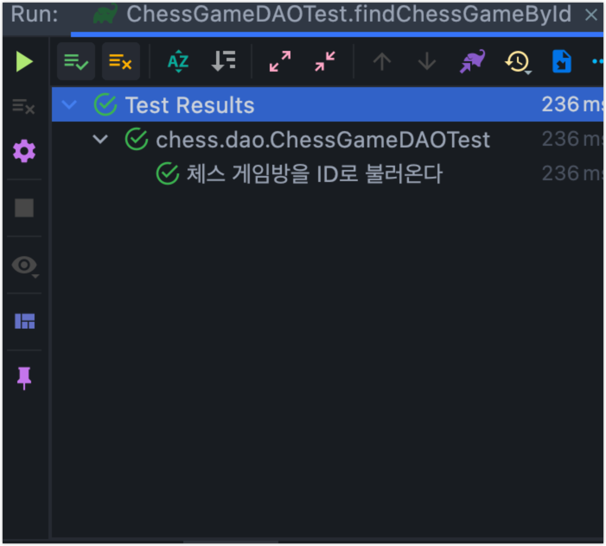
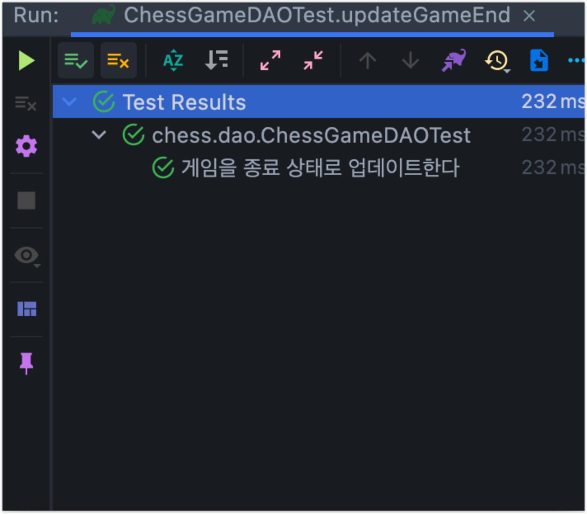
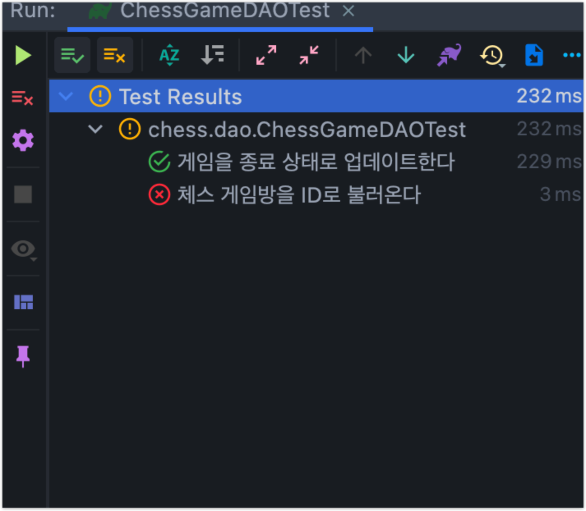
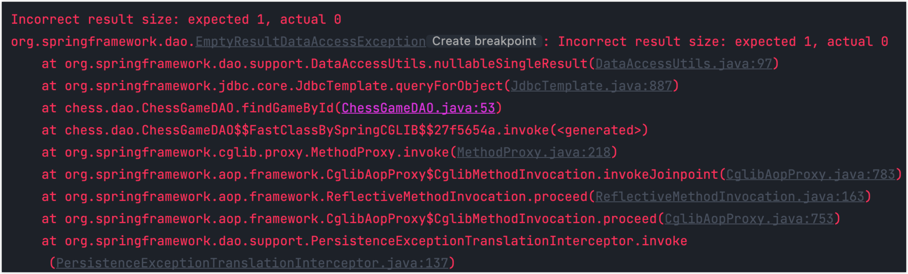
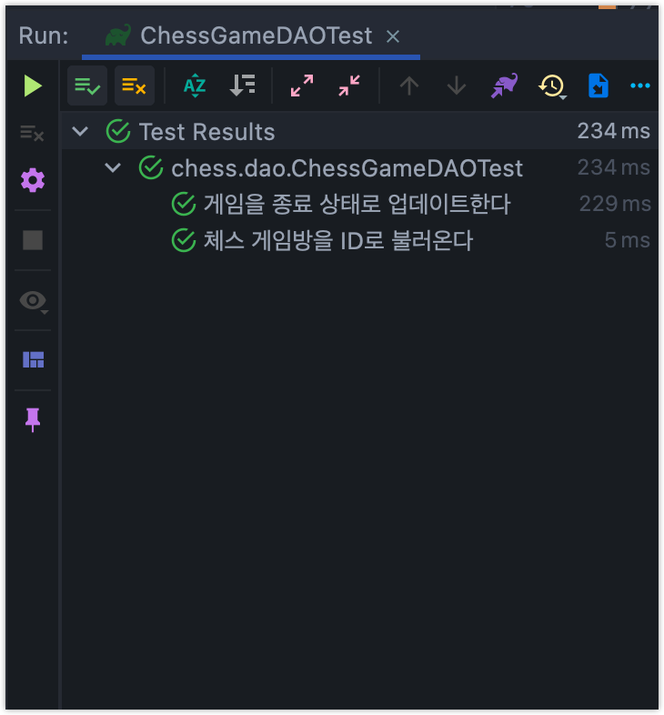

---  
emoji: 📝  
title: 'PK 의존적인 테스트를 작성하지 말자'   
date: '2022-04-27 23:00:00'  
author: 어썸오  
tags: test database
categories: 'OOP&TEST'
---  

데이터 접근 객체 테스트 작성 중 다음과 같은 문제를 겪었습니다.

```java
@SpringBootTest
@Transactional
@ActiveProfiles("test")
class ChessGameDAOTest {

    @Autowired
    private ChessGameDAO dao;

    ...

    @Test
    @DisplayName("체스 게임방을 ID로 불러온다")
    void findChessGameById() {
        // arrange
        String gameName = "test1";
        dao.addGame(new GameCreationDTO(gameName, "123"));

        // act
        ChessGame findGame = dao.findGameById(1);  // pk를 하드코딩했다.

        // assert
        assertThat(findGame.getName()).isEqualTo(gameName);
    }

    ...
}
```

DB에 게임 하나를 추가한 후, PK를 통해 해당 데이터를 잘 찾아오는지 확인하는 테스트입니다. `@Transactional` 애너테이션으로 테스트가 돌아갈 때마다 모든 변경 사항이 롤백되도록 설정했기 때문에, addGame 메서드로 추가된 데이터의 PK는 1이 될 것입니다.

예상한대로 테스트가 성공합니다.



다른 테스트를 하나 더 추가해봅시다.

게임의 상태를 종료 상태로 업데이트 하는 기능을 테스트합니다.

```java
@SpringBootTest
@Transactional
@ActiveProfiles("test")
class ChessGameDAOTest {

    @Autowired
    private ChessGameDAO dao;

    ...

    @Test
    @DisplayName("게임을 종료 상태로 업데이트한다")
    void updateGameEnd() {
        // arrange
        dao.addGame(new GameCreationDTO("test1", "123"));

        // act
        long pk = 1;
        dao.updateGameEnd(pk);
        ChessGame updatedGame = dao.findGameById(pk);

        // assert
        assertThat(updatedGame.isEnd()).isTrue();
    }

    ...
}
```

게임을 하나 추가합니다. 역시 pk는 1일 것이기 때문에 1로 추가한 게임을 찾아온 뒤 게임의 상태가 end로 변화되었는지 확인합니다.

역시 테스트가 잘 성공합니다.



그럼 이번엔 두 테스트를 같이 돌려볼까요?



갑자기 조회 테스트가 실패합니다. 에러 메시지를 살펴보니 해당 pk를 가진 데이터가 없음을 알 수 있었습니다.



이 같은 에러가 발생하는 이유는 **롤백을 하더라도 auto\_increment로 증가한 pk는 롤백 되지 않기 때문입니다.**

예를 들어 테이블 A에 insert 연산을 하고 롤백을 하면, 테이블에 데이터는 없지만 다음에 insert 되는 데이터의 pk는 2가 됩니다.

생각해보면 이렇게 설계하는 것이 당연합니다.

-   프로그램 1이 트랜잭션을 열고 테이블 A에 데이터를 추가합니다. pk는 1이 됩니다.
-   프로그램 2가 트랜잭션을 열고 테이블 A에 데이터를 추가합니다. pk는 2가 됩니다.
-   프로그램 2가 테이블 A에 추가한 pk를 fk로 사용하여 테이블 B에 어떤 데이터를 추가합니다.
-   프로그램 2가 커밋합니다.
-   프로그램 1이 롤백합니다.

참고 : [transactions - MySQL AUTO\_INCREMENT does not ROLLBACK - Stack Overflow](https://stackoverflow.com/questions/449346/mysql-auto-increment-does-not-rollback)

만약 어떤 트랜잭션이 롤백될 때, pk도 같이 롤백한다면 위와 같은 상황에서 데이터 정합성을 보장하기가 매우 어렵습니다.

따라서 **테스트를 작성할 때 auto\_increment pk에 의존하도록 작성해서는 안됩니다.** 처음의 테스트는 아래와 같이 affected row의 pk를 반환하도록 한 후 이를 이용하도록 테스트하면 안전합니다.

ChessGameDAO.java

```java
public long addGame(final GameCreationDTO gameCreationDTO) {
    String sql = "INSERT INTO CHESS_GAME (name, password) VALUES (?, ?)";
    KeyHolder keyHolder = new GeneratedKeyHolder();

    jdbcTemplate.update(connection -> {
        PreparedStatement statement = connection.prepareStatement(sql, new String[]{"id"});
        statement.setString(1, gameCreationDTO.getName());
        statement.setString(2, gameCreationDTO.getPassword());
        return statement;
    }, keyHolder);
    return keyHolder.getKey().longValue();
}
```

ChessGameDAOTest.java

```java
@Test
@DisplayName("체스 게임방을 ID로 불러온다")
void findChessGameById() {
    // arrange
    String gameName = "test1";
    long id = dao.addGame(new GameCreationDTO(gameName, "123"));

    // act
    ChessGame findGame = dao.findGameById(id);

    // assert
    assertThat(findGame.getName()).isEqualTo(gameName);
}

@Test
@DisplayName("게임을 종료 상태로 업데이트한다")
void updateGameEnd() {
    // arrange
    long addedGame = dao.addGame(new GameCreationDTO("test1", "123"));

    // act
    long updateGameId = dao.updateGameEnd(addedGame);
    ChessGame updatedGame = dao.findGameById(updateGameId);

    // assert
    assertThat(updatedGame.isEnd()).isTrue();
}
```



만약 반드시 pk를 하드코딩하여 테스트해야하는 상황이라면  `@Sql` 애너테이션 등을 통해 매 테스트가 실행될 때마다 `truncate` 키워드로 테이블을 아얘 날려버리는 방법을 사용해야합니다. 
